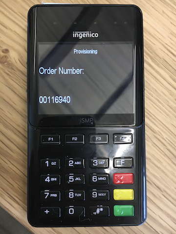

# Provisioning iSMP4 via WiFi Connection

## Entering the Order Number

Once you've powered on the iSMP4 device, the TMS Order ID Entry screen will appear. 

Proceed to enter the TMS OrderID that CardConnect has provided. 

After you enter the order number, press the green button to proceed. You will need to confirm the order number on the next screen. 

Press the green button again to confirm your TMS Order number has been entered correctly. You will now be taken to the next confirmation screen, confirming the terminal's IP address

The IP address of 0.0.0.0 means the terminal is not connected to the internet. You will need to add a WiFi connection onto the terminal by pressing the RED Cancel button. 

## Scan for WiFi networks

Highlight "Scan for networks" within the WiFi Properties Menu and press the \[Green\] button. A progress bar will be displayed during the scan.  

The result will be a display of all available WiFi networks.

  
Once a selection is made, users will be prompted for their [WiFi Password Input](https://cardconnect.gitbook.io/bolt/wifi-configuration#wifi-password-input).  
  

## WiFi Password Input

Both navigation through the on-screen keyboards, and the physical keypad may be needed to enter the Wifi password depending on the types of characters used in the password. Below is a guide for navigating using the the keyboard. 

Letters can be entered by pressing a key repeatedly until the letter is shown. Each press will cycle through Number &gt; Lowercase Letter &gt; Uppercase Letter &gt; Number. Use the Directional \[F\] keys to select the different types of on-screen keyboards.WiFi passwords must be at least 8 characters in length using any alpha-numeric character permutation  
  
Once password is entered for selected network, the device will display the following message:

  
After creating a new WiFi profile, the device must be rebooted. If the reboot does not happen automatically, please hold down the \[.,\#\*\] and \[&lt;\(Yellow\)\] keys to initiate one manually.  
Upon startup, the display footer should read "Bolted". If still "Unbolted", go back into the WiFi Properties through the Bolt Menu and select Connection Status.

