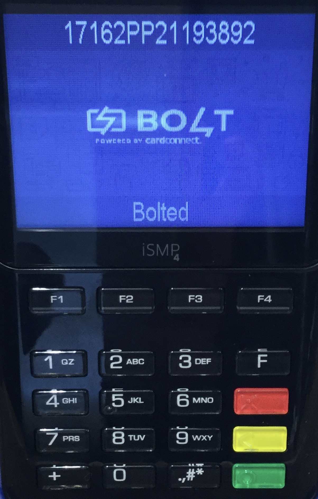
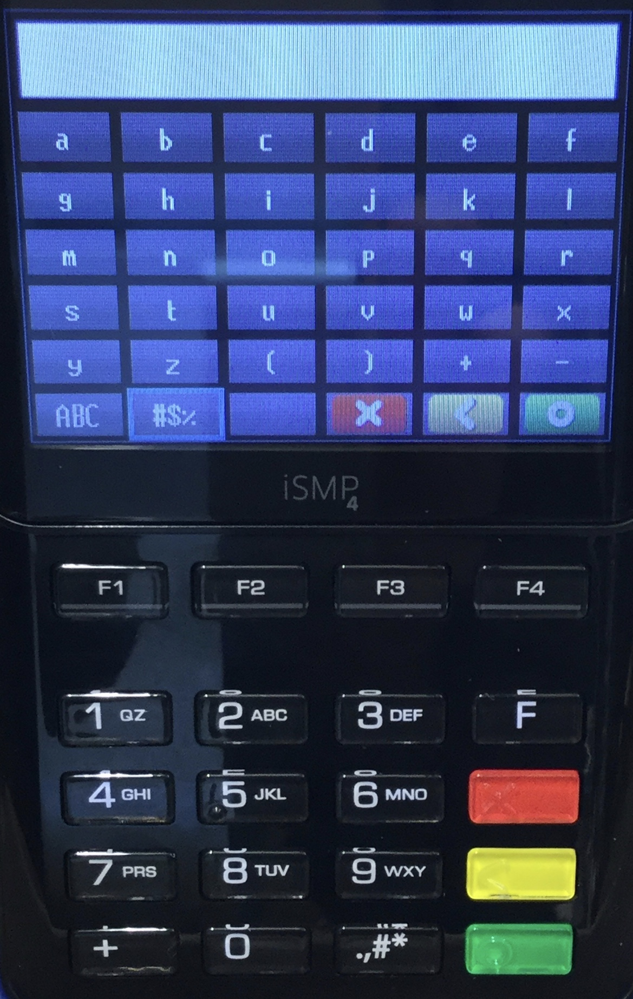

# WiFi Setup Guide

1. [Menu Navigation](wifi-configuration.md#menu-navigation)
2. [Scan for WiFi networks](wifi-configuration.md#scan-for-wifi-networks)
3. [Manually Add WiFi Profile](wifi-configuration.md#manually-add-wifi-profile)
4. [WiFi Password Input](wifi-configuration.md#wifi-password-input)
5. [Delete WiFi Profile](wifi-configuration.md#delete-wifi-profile)

## Menu Navigation

Upon receipt of your iSMP4 device, the display footer will indicate "Unbolted". This indicates that it is not connected to the internet, and therefore will not be able to connect to your POS system.   

Once a successful WiFi connection is established, this status should change to “Bolted”. 

The display header shows the device serial number or “HSN”. If troubleshooting is required, the CardConnect team may ask you to provide this information. 

The following key sequence is used to enter into the device’s Bolt \[S.O.S\] Menu:

**\[F\], \[7\], \[6\], \[7\]**


This sequence needs to be punched in consecutively and fairly quickly. 

\[7\], \[6\], \[7\] spells out **S.O.S**


Once on the Bolt \[S.O.S\] Menu, use the following keys to navigate throughout the different sections:

* \[F1\] — Left
* \[F2\] — Down
* \[F3\] — Up
* \[F4\] — Right
* \[Green\] — Select/Enter
* \[Red\] — Cancel/Return

Press \[F2\] to move the Cursor down, then select "Wifi Properties"

## Scan for WiFi networks

Highlight "Scan for networks" within the WiFi Properties Menu and press the \[Green\] button. 

A progress bar will be displayed during the scan.

The result will be a display of all available WiFi networks.

Once a selection is made, users will be prompted for their [WiFi Password Input](wifi-configuration.md#wifi-password-input).

## Manually Add WiFi Profile

Highlight "Add WiFi Profile" within the WiFi Properties Menu and press the \[Green\] button. 

Use the physical keypad to enter the WiFi network name. 

Review [WiFi Password Input](wifi-configuration.md#wifi-password-input) for typing guidance, if necessary. 

After manually entering the WiFi name, users will be prompted for their [WiFi Password Input](wifi-configuration.md#wifi-password-input).

## WiFi Password Input

Both navigation through the on-screen keyboards, and the physical keypad may be needed to enter the Wifi password depending on the types of characters used in the password.

Letters can be entered by pressing a key repeatedly until the letter is shown. Each press will cycle through Number &gt; Lowercase Letter &gt; Uppercase Letter &gt; Number

Use the Directional \[F\] keys to select the different types of on-screen keyboards.

WiFi passwords must be at least 8 characters in length using any alpha-numeric character permutation

Once password is entered for selected network, the device will display the following message: 

After creating a new WiFi profile, the device must be rebooted. If the reboot does not happen automatically, please hold down the \[.,\#\*\] and \[&lt;\(Yellow\)\] keys to initiate one manually. 

Upon startup, the display footer should read "Bolted". If still "Unbolted", go back into the WiFi Properties through the Bolt Menu and select Connection Status. 

## Delete WiFi Profile

